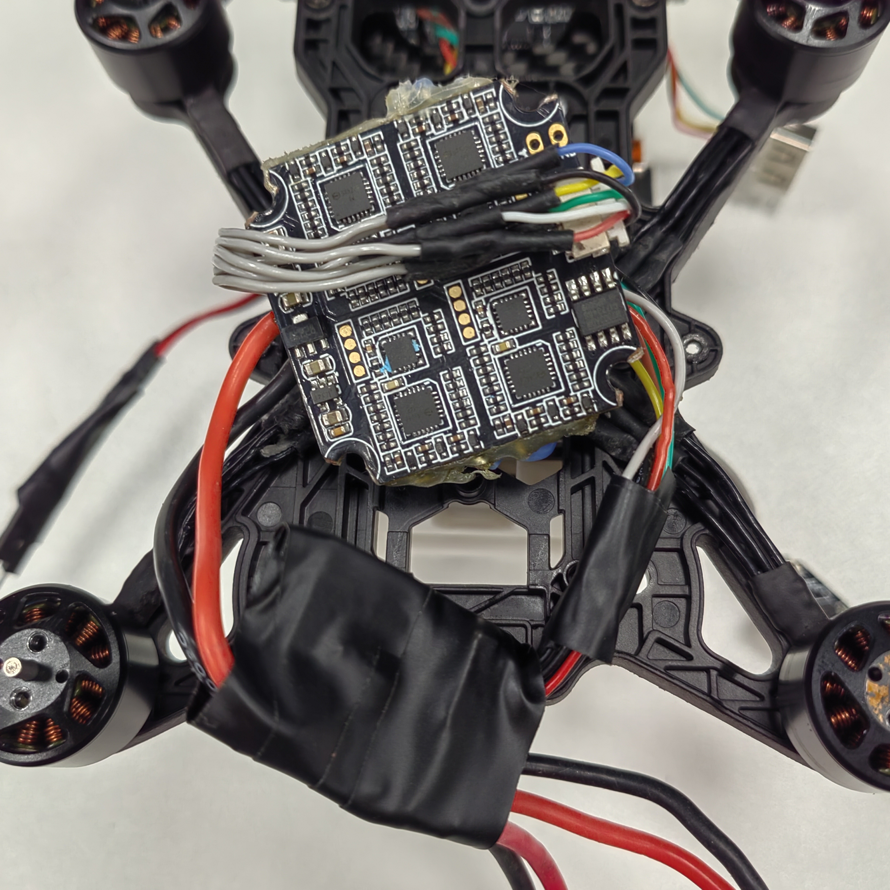
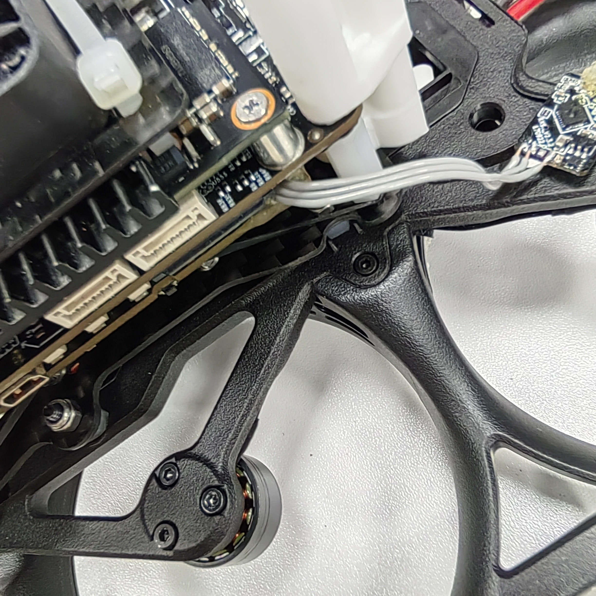
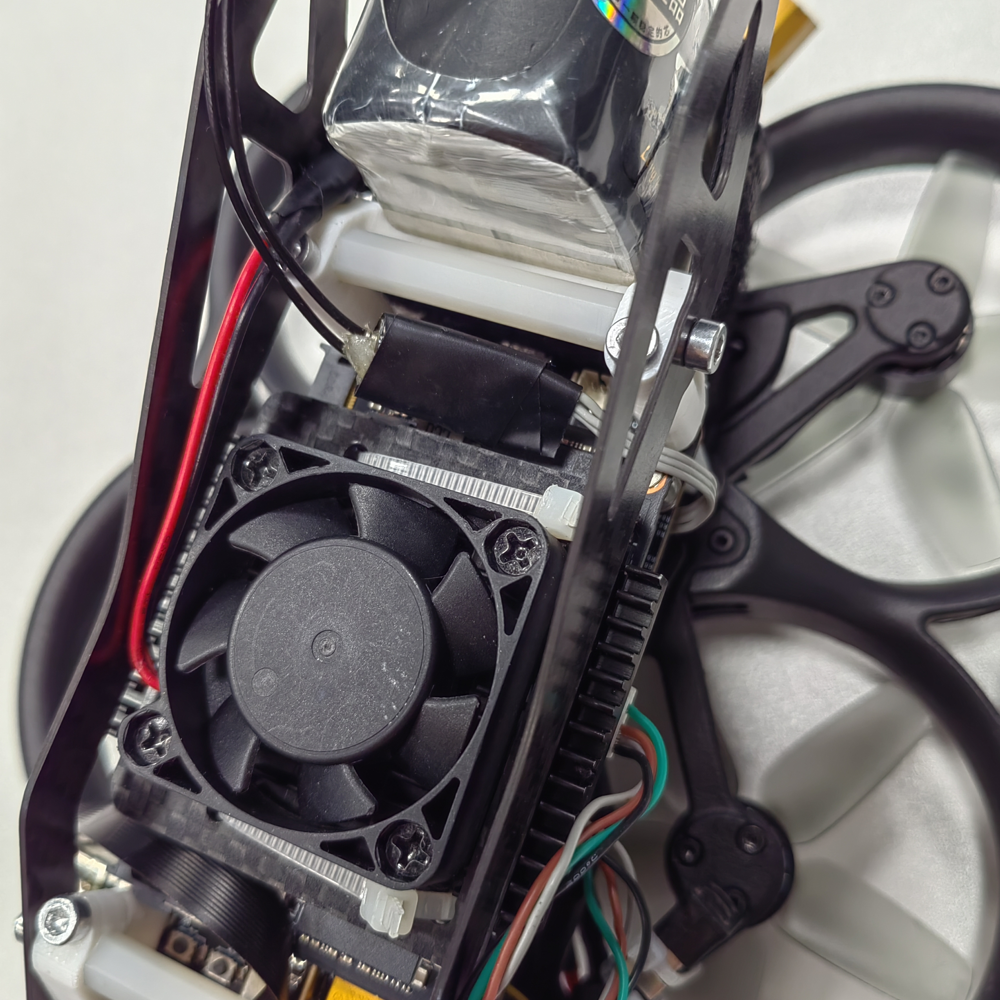
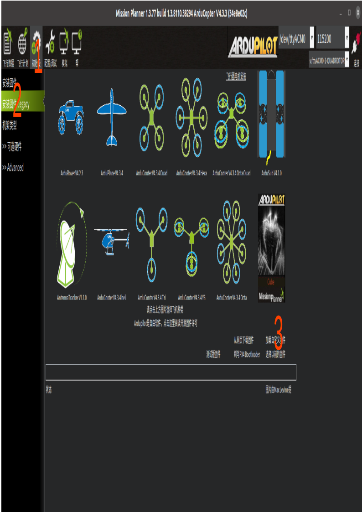
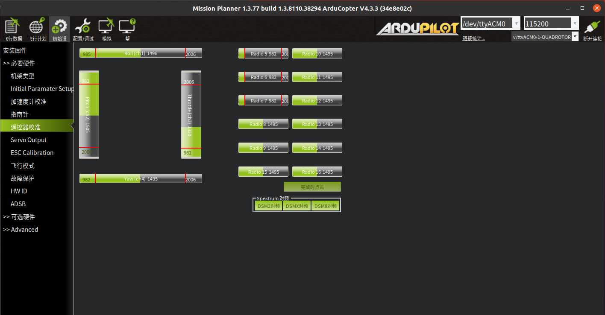
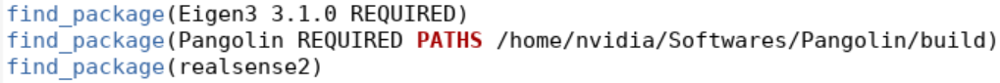
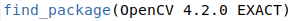

## 目录
---
>简述  
>版本   
>线路连接  
>Jetson NX配置  
>组装说明  
>飞控软件配置  
>遥控设置  
>第一次飞行  
>视觉定位   
>离线控制  
>高级  
>Q&A

## 简述
---
>基于DJI Avata机身与Ardupilot开源飞控设计的自主无人机平台开源方案。*boms.xlsx*文件提供了详细的物料信息，结合本文档可以制作出完整的自主飞行无人机平台。  
该无人机平台使用英伟达Jetson_NX为机载算力平台，Realsense D430为视觉模块，pixhawk2.4.8为飞控。本开源方案集成了视觉定位功能，可直接使用遥控定高，定点控制，或者基于ros离线控制无人机。 
本方案具有一定程度的抗撞击特性，经过18次各个面从3米高度自由落体到爬行垫上的测试后，无人机能正常进行定点飞行，测试过程参考 *docs/videos/撞击测试.mp4*

## 版本  
---
### V1.0

## 线路连接
---
    

> 线序说明参考 *docs/boms.xlsx*。  
>1. 电机-电调连接线，按图示顺序依次焊接即可。
>2. 电调-电流计连接线，需注意正负极。
>3. 电池-风扇-电流计并联线，若风扇转向相反，可手动调换风扇2pin接口线序。  
 
>4. 电流计-记载电脑电源线，焊接时需注意正负极。
>5. 电流计-飞控电源线，直接连接即可，两端无区别。  
  
>6. 飞控-Jetson NX串口线, GH端口（下边）接入Jetson NX UART1(中间的串口)，JST端口（上边）接入飞控TELEM1或者TELEM2。  
  
>7. 电机信号线，下图一为电调端接口，除了红黑线外，其余线对应电调上的1~4号电机标识。下图二为飞控上的引脚定义，蓝色为可用电机线号接口，红色是正极，黑色是负极。电机线号线的红黑色线必须接到对应颜色的飞控端口，其余四根线可随意接在蓝色任意端口。  
 
  
>8. FPC软排线type-c数据线。  
>9. 接收器连接线。  
    
>10. usb wifi 模块转接线。  
 

## Jetson NX配置
---
### 使用SDK Manager刷写系统
>Jetson NX需要先使用官方的*SDK Manager*软件刷系统进入EMMC中，确认EMMC系统工作之后才能在SD卡刷系统。载板使用参考*docs/NCB00使用说明书v1.8.pdf*。  
>1. 首先在*UBUNTU 20.04*中下载*SDK Manager*，地址为 *https://developer.nvidia.com/sdkmanager_deb*。安装成功后，打开软件，使用开发者账户登录。  
>
>    
>2. 给Jetson NX接入电源，红色电源指示灯亮起。在type c接口旁边有两个按键，分别是*REC*,*RST*。按住*REC*两秒后，按一下*RST*，接着松开*REC*。当红色指示灯变暗时（不是熄灭），说明Jetson NX进入了刷机模式。此时会提示检测到硬件，选择第一项。  
>  
>3. 在操作系统中选择*Jetpack 5.0.2*，取消勾选*Deepstream*。点击*Continue*。  
> 
>4. *Target Components*为可选项，可以在这里一起安装或者之后自行安装。勾选*I accept ....* 后，点击*Continue*。  
> 
>5. 如果提示文件夹不存在要创建之类的问题，点击确认。按提示输入管理员密码后，进入刷机流程，等待即可。  
> 
>6. 下载完毕之后出现如下页。选择*Manaual Setup-Jetson Xavier NX*。7处选择*Pre-Config*,下方输入要使用的用户名和密码，这里用了默认的*nvidia*作为账户密码。此时连接显示器和键盘鼠标到NX上，方便查看刷写进度，然后点击*Falsh*后等待。再接近完成时，NX会自动从刷机模式退出进入系统，显示屏中会出现系统开机画面。继续等待直到*SDK Manager*提示*Installation Completed Successfully*。  
> 
>7. 点击*Finish*退出程序。  
> 
>备注：使用sd卡作为系统启动盘请参考 *files/ncb_驱动包_5.0.2/readme* 和 *docs/NCB00使用说明书v1.8.pdf*。

### 远程连接方案
>1. 准备一台路由器，使用网线连接主机与该路由器的LAN口。进入它的配置页面，在LAN配置中设置静态IP地址，这里分配的是 *192.168.100.1*，子网掩码是 *255.255.255.0*。  
>
>2. 设置无线网络。  
>
>3. 使用usb2.0转接线连接wifiusb模块到NX中。  
>
>4. 在NX中找到所配置的无线网络并连接。
>>Jetpack5中使用usb wifi 模块需要安装驱动。首先使用网线接口把NX联网，然后执行指令   
`sudo ubuntu-drivers autoinstall`  
`sudo apt update`  
`sudo apt install build-essential dkms gcc git make`  
`git clone https://github.com/brektrou/rtl8821CU.git`  
`cd rtl8821CU/`   
`chmod +x dkms-install.sh`  
`sudo ./dkms-install.sh`  
`sudo modprobe 8821cu`    
完成之后重启NX, wifi模块能够识别，选择相应的无线网络连接即可。  
>5. 在静态地址分配中找到NX的MAC地址并分配一个静态网址给它，这样当NX用wifi接入路由器后所得到的地址就不会变，方便后续ssh远程连接。
>    
>6. 使用ssh远程连接NX。  
>   

## 组装说明
---
>1. 把4颗M3.0\*10铝合金螺丝，4颗M3.0\*15尼龙柱，4颗4\*2.7\*2.5黑色ABS隔离柱与飞控固定板组装在一起。  
>
>
>  
>2. 使用2颗M3.0\*16铝合金螺丝与2颗M3.0防松螺母将电池固定架在飞控固定板上。  
>
>  
>3. 将两个黑色皮筋放到尼龙柱的底部。  
>
>  
>4. 把4颗M3.0\*10铝合金螺丝，4颗M3.0防松螺母和8颗4\*2.7\*2.5ABS黑色隔离柱与飞控按图示组装在一起。  
>
>    
>5. 按图示把黑色皮筋挂到飞控上。   
>
>  
>6. 使用尼龙扎带，风扇固定板把机载电脑与散热模块组装在一起，散热模块与NX核心模块之间需要涂导热硅脂。     
>
>
>  
>7. 按图示把2个皮筋挂到飞控的螺丝和尼龙柱上后，使用2颗M3.0\*25铝合金螺丝，2颗M3.0\*35铝合金螺丝和4颗4\*2.7\*2.5ABS黑色隔离柱把侧边防护固定件，机载电脑和飞控固定在一起。隔离柱处于机载电脑的下方。在组装时要使用钳子固定住下方尼龙柱，防止其旋转拉扯到皮筋。  
>
>  
>8. 如图将上一步中飞控上方挂到尼龙柱的皮筋用螺丝刀提到隔离柱的位置上，完成后飞控的姿态应当保持居中水平不与结构件发生碰撞。    
>
>  
>9. 使用2颗M1.4\*5螺丝把相机镜头与相机固定件连接后，使用3mm厚度3M双面海绵胶带把镜头与PCB板固定。    
>
>  
>10. 把usb wifi连接线装到载板上。  
>  
>11. 使用2颗M3.0\*5平头螺丝将相机模块固定到飞控固定板上。  
>
>
>
>12. 使用12颗M2.0\*5螺丝将电机按图示顺序固定到底板上。   
>
>  
>13. 把飞控电源线穿过底板中间孔位后接入电调中。  
>    
>14. 使用美工刀将图示红色框中的部分削平。  
>  
>15. 把4颗M2.5\*16螺丝与4颗M3.0\*5尼龙柱按图示固定到底板上,然后把电机信号线通过图示孔位穿过底板。    
>
>
>16. 如图使用4颗M2.5防松螺母把上下部分组装在一起。   
>  
>17. 把电机信号线接入电调中，然后使用电工胶带把电流计包裹住以防止短路，接着使用扎带把电调、电流计等固定好。  
>
>  
>18. 把NX电源线通过图示孔位穿过涵道圈。     
>    
>19. 使用4颗M2.0\*4螺丝将底板和涵道圈固定在一起。  
>
>  
>  
>20. 把NX电源线接入NX中，把串口线接入飞控TELEM1或者TELEM2和NX UART1中(串口线建议从飞控上方穿过)。同时把风扇线固定好。  
>
>  
>
>  
>21. 使用2颗M3.0防松螺母，4颗M3.0\*16铝合金螺丝，2颗M3.0\*10铝合金螺丝和2颗M3.0\*35尼龙柱把2个侧边防护板固定到机身上。  
>
>  
>22. 使用8颗M2.0\*6螺丝将桨叶固定到电机上，注意图示中不同桨叶的区别（是否带有黄点）。  
>
>  
>23. 使用6颗M2.0*4螺丝将加强件固定到涵道圈上。  
>
>
>24. 使用扎带把usb wifi模块，NX电源线，风扇线等固定好，其中wifi模块要按照图示放置以减少对进气的干扰。  
>
>  
>
>  
>25. 通电后效果。  
>
>  
>
>  
>
>

## 飞控软件配置
---
### mission planner
mission planner 是ardupilot的地面站控制软件，参考 *https://ardupilot.org/planner/docs/mission-planner-installation.html#mission-planner-on-linux* 进行安装。 

### 安装固件
>1. 使用micro usb 连接电脑与pixhawk2.4.8。
>2. 依次点击 *初始设置*，*安装固件 Legacy*，*加载自定义固件*。
  
>3. 选择 *arducopter 4.3.3_pixhawk.apj*，等待直到显示 *upload done*。
  

### 加载默认参数配置
>1. 使用micro usb 连接电脑与pixhawk2.4.8后，在右上角的端口下拉框中找到飞控对应的端口，右边的数字为串口波特率，选择*115200*，然后点击连接。最右上角的插头标识变为绿色说明连接成功。
>2. 依次点击 *配置/调试*，*全部参数*，*加载*。
  
>3. 选择 *ardupilot4.0_0329_fmuv3.param*，然后点击写入参数。显示 *Parameters successfully saved* 说明写入成功。  
    

## 遥控设置  
---
### 固件更新
>遥控器与接收机有各自的固件需要更新。本文档测试时，遥控器固件版本为2.3.15，接收机版本为2.1.6。遥控器与接受机的版本均分为国际版和欧洲版，两者必须同为欧洲版或同为国际版才能对频。  
遥控固件更新教程：*https://oscarliang.com/flash-opentx-firmware-taranis/#Download-OpenTX-Companion* ，同级文件目录中的 *Frisky遥控器固件* 为文档中所使用的遥控器固件。  
接收器固件更新教程：*https://oscarliang.com/flash-frsky-rx-firmware/*  
参考视频教程：*https://www.bilibili.com/video/BV1rf4y1k7G4/?spm_id_from=333.788.recommend_more_video.-1&vd_source=501a32fc8675f1e157424cbdfbb38d3e*
### 遥控器模型配置
>1. 在 *http://www.open-tx.org/2022/04/22/opentx-2.3.15* 中根据使用的操作系统下载相应软件，这里使用Linux版本软件。
>2. 安装并打开软件。
  
>3. 如图，同时按这三个按键，使遥控器进入*bootloader*，然后使用usb线接入电脑。

>4. 点击*文件*， *打开*，选择*遥控器配置.otx*后出现*aa_a*模型配置。

>5. 点击左侧图标*将模型和配置写入遥控器*，等待写入完成。
### 接收机配对
>参考视频教程（30分53秒处）：*https://www.bilibili.com/video/BV1rf4y1k7G4/?spm_id_from=333.788.recommend_more_video.-1&vd_source=501a32fc8675f1e157424cbdfbb38d3e*   
>配对完成后，给无人机和遥控上电，看到接收器led灯由红色转绿色，遥控器屏幕中出现信号图标说明已经进入工作状态。  
>
>  

### 遥控器校准
>依次点击*初始设置*，*必要硬件*，*遥控器校准*，*校准遥控*后，两次弹出框点击*ok*。
  
>此时绿色柱中会出现红色标识，将两个摇杆以及所有按键/旋钮推到极限位置，当绿色柱子呈现如图所示的状态时，点击*完成时点击*按钮即可。
>依次点击*初始设置*，*必要硬件*，*遥控器校准*，*校准遥控*后，两次弹出框点击*ok*。
  
### 摇杆功能
  

>遥控器的各个摇杆都是一个独立的输入源，这个输入源可以在遥控器中分配到不同的信道中。在飞控的参数配置中把信道跟不同的功能（如模式切换，横滚，俯仰，偏航，油门等）绑定在一起。由此，遥控与无人机就通过信道联系起来了。如下为默认配置文件中的摇杆功能分配。  
J1: 信道1，横滚。  
J2: 信道3，油门。  
J3: 信道2，俯仰。  
J4: 信道4，偏航。  
SG: 信道5，模式切换（max:自稳，center:定高，min:定点）。  
SH: 信道7，降落。  

## 第一次飞行
---
### IMU校准
>打开*Mission Planner*， 连接无人机后，点击 *初始设置* *必要硬件* *加速度计校准*。根据提示依次完成三项校准操作。
>    
### 电机校准
>1. 电机序号和转向在 *初始设置* *可选硬件* *点击测试* 中可以进行测试。
>  
>2. 把无人机的桨叶卸下来之后，依次点击 *Test Motor A* *Test Motor B* *Test Motor C* *Test Motor D* ,可以看到点击会分别转动。转动方向和序号应当符合下图所示。
>   
>3. 点击的序号和转动方向可以在 *初始设置* *必要硬件* *Servo Output* 中设置。 9-14号端口就是安装线路连接部分中展示的，电机线号线与飞控板连接6个可用端口。 勾选 *Reverse* 可更改相应电机的转动方向。
>  
### 手动自稳模式飞行
>完成上所述步骤，将桨叶安装好，重启无人机，启动遥控器后，把SG往上打切换到自稳模式，内八字打杆启动无人机，开始第一次飞行。

## 视觉定位
---
### Realsense驱动安装
>1. 断开相机连接，用SSH连接NX后，在NX中执行指令。  
>2. `git clone https://github.com/IntelRealSense/librealsense.git`  
>3. `sudo apt-get install curl git libssl-dev libusb-1.0-0-dev libudev-dev pkg-config libgtk-3-dev libglfw3-dev libgl1-mesa-dev libglu1-mesa-dev at apriltag`  
>4. `cd librealsense && sudo ./scripts/setup_udev_rules.sh`  
>5. `mkdir build && cd build`    
>6. `cmake .. -DCMAKE_BUILD_TYPE=Release -DBUILD_EXAMPLES=true`     
>7. `sudo make uninstall && make clean && make && sudo make install`  
>8. 连接相机后执行   `rs-hello-realsense`   
>9. 此时终端显示当前探测到的物体的距离，说明相机已经正常工作。
>  

### 安装ros
>1. `sudo sh -c 'echo "deb http://packages.ros.org/ros/ubuntu $(lsb_release -sc) main" > /etc/apt/sources.list.d/ros-latest.list'`  
>2. `curl -s https://raw.githubusercontent.com/ros/rosdistro/master/ros.asc | sudo apt-key add -`    
>3. `sudo apt update`  
>4. `sudo apt install ros-noetic-desktop python3-catkin-tools`  

### 安装opencv
>1. `git clone https://github.com/opencv/opencv.git --branch 4.2.0`  
>2. `cd opencv && mkdir build && cd build && cmake .. -DCMAKE_BUILD_TYPE=Release && make -j 6`  
>3. `sudo make install`  
>4. `sudo ldconfig`  

### 安装ORBSLAM3
>1. `cd ~ && git clone --recursive https://github.com/stevenlovegrove/Pangolin.git --branch v0.5`  
>2. `sudo apt install libglew-dev`  
>3. `cd Pangolin && mkdir build && cd build && cmake .. && make`    
>4. `cd ~ && git clone https://github.com/UZ-SLAMLab/ORB_SLAM3.git --branch v1.0-release`  
>5. `cd ORB_SLAM3`  
>6. 在*CMakeLists.txt*中按图示修改编译器版本，注意*add_definitions*参数不能改。
>   
>7. 在*CMakeLists.txt*中指定Pangolin的package路径，例如把*find_package(Pangolin REQUIRED)*修改为*find_package(Pangolin REQUIRED PATHS /home/nvidia/Softwares/Pangolin/build)*。
>   
>8. 在*CMakeLists.txt*和*Thirdparty/DBoW2/CmakeLists.txt*中指定*opencv*版本。  
>  
>9. `./build.sh #若编译过程中出现系统卡死的现象，参考最后一章Q&A第一节`   

### 编译功能包
>1. 把*catkin_ws_d430_ros* 文件夹拷贝到NX中。然后在NX的终端中，进入*catkin_ws_d430_ros*目录。   
>    
>2. `source /opt/ros/noetic/setup.bash`     
>3. 在*src/d430_slam/CMakeLists.txt*文件中，如图修改*orbslam*路径,该路径是*ORBSLAM3*的文件目录,不是*build*目录。  
>   
>4. 修改*src/d430_slam/src/node/orbslam.cpp*文件中，图示两个路径。第一个是*ORBSLAM3*的*ORBvoc.txt*所在路径，第二个是*settings.yaml*所在路径。  
>
>5. 安装依赖。`sudo apt install ros-noetic-mavros*`   
>6. 开始编译。`catkin build d430_slam apm_d430_bridge`    
>7. `sudo /opt/ros/noetic/lib/mavros/install_geographiclib_datasets.sh`     
>8. 启动视觉定位功能和远程通信功能。 `roslaunch d430_slam apm_d430_slam.launch`  

### 手动定点飞行
飞行效果参考： *docs/videos/手动定点飞行.mp4*。  
>1. 接着上一步，打开*MissionPlanner*，右上角选择*UDPCI*模式后点击连接。     
>  
>2. 在弹出框输入NX网络地址和*14550*端口号。  
>
>   
>3. 连接完成后无人机各项数据会显示在界面中。  
>   
>4. 使用遥控器切换飞行模式到*Loiter*, 窗口右下角会显示切换到的飞行模式。  
>  
>5. 使用遥控器油门控制，无人机会直线上升。油门居中后，无人机会定点悬停。  

## 离线控制
---
### 案例使用
飞行效果参考： *docs/videos/离线控制悬浮.mp4*，*docs/videos/离线控制位置控制巡航.mp4*，*docs/videos/离线控制速度控制巡航.mp4*。  
>在*catkin_ws_d430_ros/src/offboard*中完成了三个基本控制样例，分别实现了定点悬浮，位置控制巡航和速度控制巡航。通过在*offboard_test_node.cpp*中注释的方式激活特定案例。巡航案例中使用的均为简单的PID走航点模式，轨迹跟踪效果一般，仅供参考。    
>  
>1. 在NX中，进入*catkin_ws_d430_ros*文件夹中，编译样例。  
`catkin build offboard`  
>2. 启动定位功能与远程通信通能后并连接*MissionPlanner*，使用脚本设置原点。  
`pip3 install pymavlink`  
`python set_origin.py`  
>3. 完成后，会显示一台无人机在界面上，并且下方的高度会变成0.0m。  
>  
>4. 启动程序。  
`source devel/setup.bash && rosrun offboard offboard_test_node`  

### 无人机开发
完成上述步骤后，即可通过订阅主题的方式获得无人机的数据，并通过给特定主题发布数据来控制无人机。  

#### 可订阅主题（部分）
>slam原始数据： `/d430_camera/pose`   
>电池剩余电量： `/mavros/battery`  
>设置的世界坐标原点经纬度信息： `/mavros/home_position/home`  
>imu数据： `/mavros/imu/data_raw`  
>导航数据： `/mavros/local_position/odom`  
>姿态数据： `/mavros/local_position/pose`  
>无人机运行状态： `/mavros/state`  

#### 控制指令
通过给 `mavros/setpoint_raw/local` 主题发布数据即可完成位置控制，速度控制，姿态控制和角速度推力控制等。该主题数据类型为 `mavros_msgs/PositionTarget`，具体使用参考程序案例以及官方页面:   *http://docs.ros.org/en/api/mavros_msgs/html/msg/PositionTarget.html*。  
要注意的是，官方说明中参考坐标系是*NED/FRD*,但是实际使用中发现无人机还是按照*FLU*进行运动。

## 高级
---
### 外部定位数据
通过往 `/mavros/vision/pose` 或者 `/mavros/odometry/out` 中发布位姿信息即可完成，本案例中仅有位置和姿态数据，没有速度信息，所以使用前一个主题进行发布。要注意的是，APM中使用的是*FRD坐标系*（左边），而*MAVROS*使用的是*FLU坐标系*（右边），它内部会自动完成这两者的转化，因此导入数据时只要能保证数据是基于*FLU*的即可。如果使用了电子罗盘作为外部偏航角输入，则APM参考系变为*NED坐标系*具体细节参考：    
http://docs.px4.io/main/en/ros/external_position_estimation.html
>  

### PID参数
>1. 角度控制器。  
>2. 角速度控制器。   
>3. 垂直加速度控制器，垂直速度控制器，垂直位置控制器。  
>4. 水平位置控制器，水平速度控制器。  
>  

### 飞行数据
>1. 点击*飞行数据*，*数据闪存日志*，*通过MAVLINK下载闪存日志*把SD卡中的对应数据文件下载到本地。  
>     
>2. 点击*回顾日志*，选择对应日志文件后打开会出现数据图表。图表右侧中是记录下来的各项数据，勾选对应数据即可显示，例如勾选*ATT*中的*DesRoll*和*Roll*。  
>    
>>部分重要数据说明：   
>>ATT: 飞机三轴姿态，包含期望姿态与实际姿态。  
CTUN: 高度信息以及油门控制信息。  
IMU: 各个IMU的陀螺仪和加速度计数据。 
PSCX: 位置控制时，三轴方向上的期望位置，期望速度，期望加速度与实际位置，实际速度与实际加速度。  
RATE: 飞机三轴期望角速度与实际速度，垂直方向期望加速度与实际加速度。  
RCIN:  遥控器个通道输入。  
VIBE: 各个IMU的震动偏差值。  
VISP: 外部定位数据。  
XKF1: 外部定位数据与IMU融合后的位姿数据。  

### 配置参数（部分）
例举了部分重要配置参数及其简介，在后方括号中是默认配置文件中的值。  
>AHRS_EKF_TYPE: 传感器融合计算器，可选EKF2或者EKF3。（3）  
>AHRS_GPS_USE: 是否使用GPS。（0）  
>AHRS_ORIENTATION: IMU X轴朝向。（0）  
>ARMING_CHECK: 起飞前检查的数据。（386）  
>ATC: pid参数。  
>BATT_LOW_TIMER: 电池电压不足后多久出发动作。（5）  
>BATT_LOW_VOLT: 电池低电压触发值。（13.5）  
>BATT_MONITOR: 监控模式。（3）  
>BATT_VOLT_MULT: 电压系数，用于把读取到的信号值转化为真实电压数据。（10.88）  
>BATT_CURR_PIN: 飞控板型号以配置检测引脚。（3）  
>BATT_FS_CRT_ACT:  低电压触发后执行的动作。 （1）  
>BATT_FS_LOW_ACT:  低电压触发后执行的动作。 （1）   
>BRD_RTC_TYPES: 选择时钟信号源。（6）  
>BRD_TYPE: 飞控板型号。（2）  
>COMPASS_ENABLE: 是否激活罗盘。（0）  
>EK3_ACC_P_NSE: 加速度计信任权重，越大越不信任。（1）  
>EK3_ALT_M_NSE: 气压计信任权重，越大越不信任。（10）  
>EK3_BCN_M_NSE: Becon信任权重，越大越不信任。（10）  
>EK3_EAS_M_NSE: 空速计信任权重，越大越不信任。（5）   
>EK3_ENABLE: 启动EKF3。（1）  
>EK3_FLOW_M_NSE: 光流信任权重，越大越不信任。（1）  
>EK3_FLOW_USE: 使用光流。（0）  
>EK3_HGT_DELAY: 高度数据与IMU数据时间差。（150）  
>EK3_PRIMARY: 优先使用那个IMU。（1）  
>EK3_SRCX_POSXY: 水平位置数据来源。（6）    
>EK3_SRCX_POSZ: 垂直位置数据来源。（6）   
>EK3_SRCX_VELXY: 水平速度数据来源。（6）   
>EK3_SRCX_VELZ: 垂直速度数据来源。（6）   
>EK3_SRCX_YAW: 偏航角数据来源。（6）     
>FLTMODE_CH: 控制模式切换的通道。（5）    
>FLEMODEX: 不同数值对应的飞行模式。    
>RNGFNDX_TYPE: 接入的测距模块型号。（0）  
>RCX_OPTION: 该通道绑定的行为。  (RC7_OPTION:18)    
>SERIAL1_BAUD: 串口模特率。（921）    
>SERIAL1_PROTOCOL: 通信协议。（2）   
>SERIAL2_BAUD: 串口模特率。（921）    
>SERIAL2_PROTOCOL: 通信协议。（2）   
>VISO_TYPE: 外部定位数据类型。（2）    
>VISO_DELAY_MS: 外部定位数据延时。 （150）    
>VISO_ORIENT: 相机朝向。（0）    
>VISO_POS_M_NSE: 外部定位数据信任权重，越大越不信任。（0.1）  

## Q&A
---
### Jetson NX突然卡死
>有一种可能性是分配的swap空间太小，运行程序过程中把内存占满导致系统卡死，增加swap空间可解决该问题。  
1. `sudo fallocate 6G /swapfile`  
2. `sudo chmod 560 /swapfile`    
3. `sudo mkswap /swapfile`    
4. `sudo swapon /swapfile`   
5. `sudo cp /etc/fstab /etc/fstab.bak`  
6. `echo '/swapfile none swap sw 0 0' | sudo tee -a /etc/fstab`  

### 时间同步问题
>NX如果没有接入互联网，其系统时间与主机会不一致，会导致程序编译，文件同步等出问题，可使用 *chrony* 工具同步主机与NX的时间。  
>1. 在NX与主机都安装chrony： `sudo apt install chrony`   
>2. 在主机的 */etc/chrony/chrony.conf* 文件中添加 *allow 192.168.100.1/24*, 这个网段需要根据自己的配置进行设置。然后重启服务： `sudo systemctl restart chrony`  
>3. 如下图修改NX的 */etc/chrony/chrony.conf* 文件，server地址是主机的IP地址，然后重启服务： `sudo systemctl restart chrony`  
>   
>4. 在NX中执行 `chronyc waitsync`， 等待同步完成即可。  

### 手动定点模式水平方向持续漂移
>其中一个可能性是遥控的输入没有校准，导致水平方向持续输出杆量。可以通过查看飞行数据的*RCIN*第2，第4通道（pitch和roll对应的通道）确认是否如此。这种情况可以通过在MissionPlanner中校准遥控以及遥控器自身的校准解决。遥控器校准功能需要长按*menu*后按*page*进入第6页，按提示操作即可。   
>     
